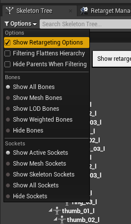
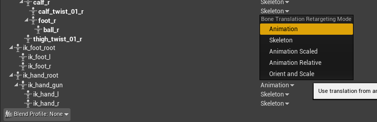

# ShooterDevAnimationUtils
Plugin creating useful animation modifier and blueprint functionality, to automate various animation-content related tasks in one of my hobby projects

For a UE4 FPS project I'm creating as a hobby project, I needed a way to modify existing animations to snap a gun bone to the player's hands.
This plugin contains an animation modifier that will keyframe a bone to follow another bone's transform. 

This probably isn't useful for anyone else, but I thought I'd share it anyway just in case someone else finds this useful.
The Animation Modifier is written in native C++, with a derived Blueprint subclass that defaults the Source and Destination bone names for a particular use case (keyframing the ik_hand_gun bone to match the transform of hand_r)

## It doesn't work, only the bone's rotation gets copied over

Hello person who is almost certainly Future Bryan, if you are reading this then you need to go into the retargeting options for your skeleton...

and then set the bone to get its translation information from the Animation, instead of the Skeleton. 

